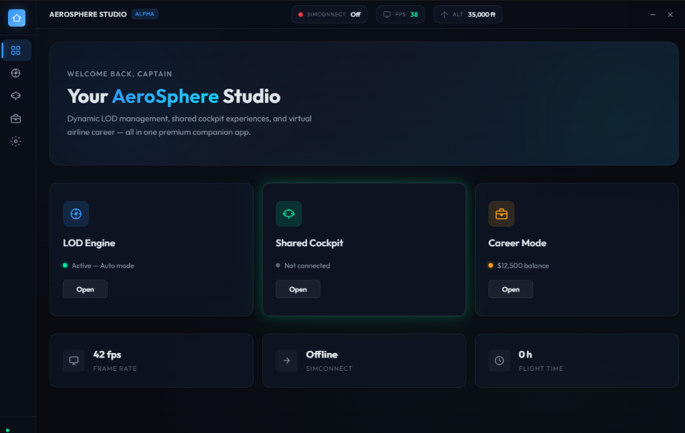
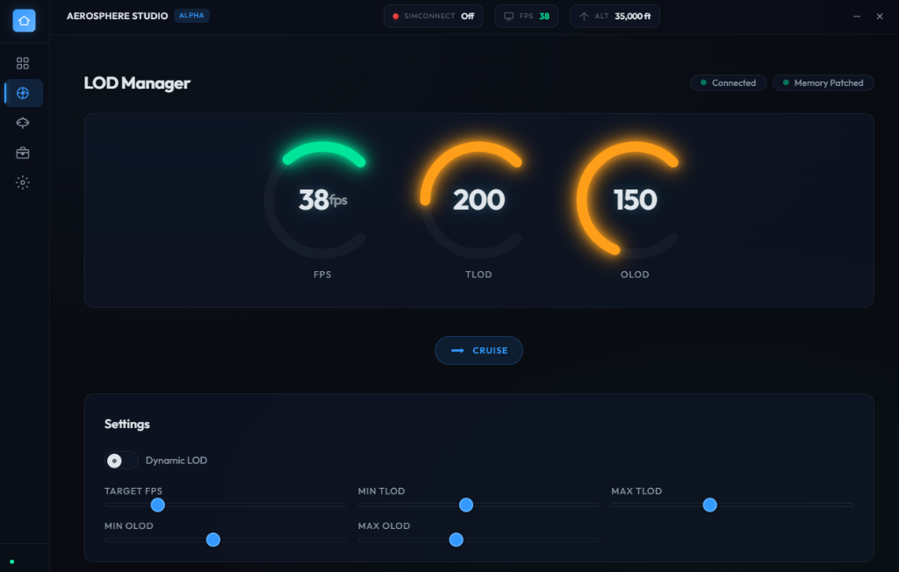
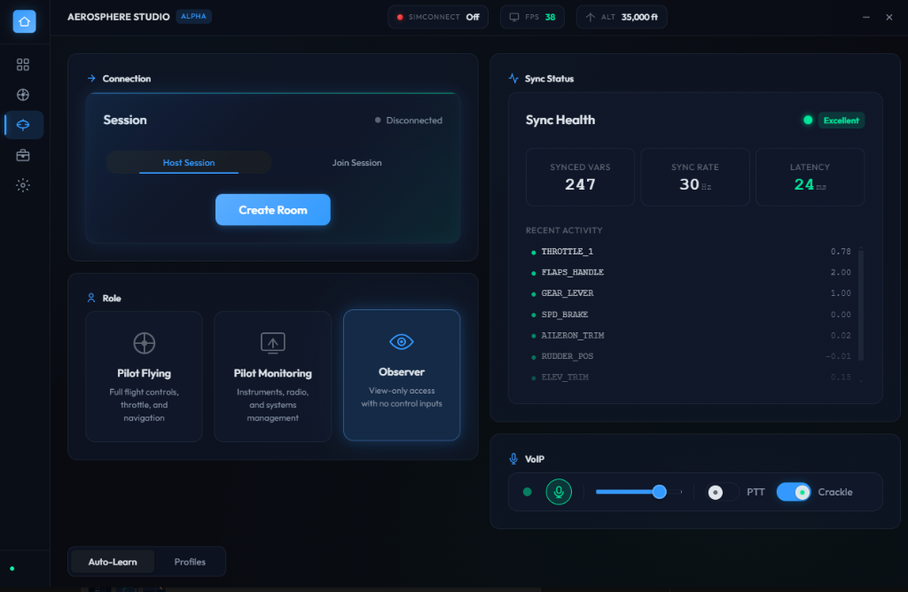
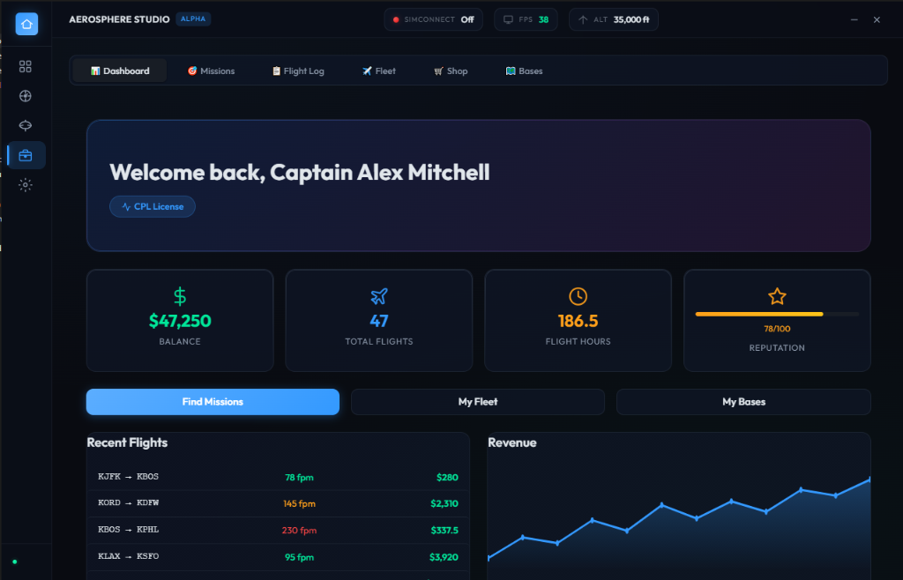
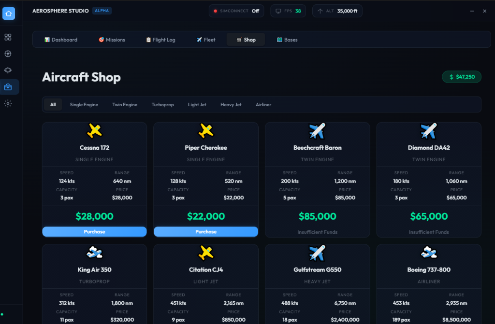
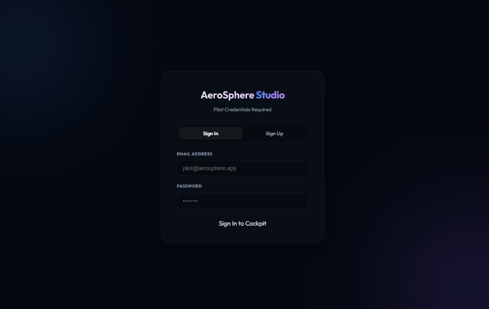

# 🪐 AeroSphere Studio

[](https://github.com/michaelmagdy15/AeroSphere/releases)
[](https://www.typescriptlang.org/)
[](https://www.electronjs.org/)
[](https://react.dev/)

A unified, high-performance desktop co-op, career, and performance suite for **Microsoft Flight Simulator 2024**. Crafted with a premium dark glassmorphism aesthetic, featuring username/email/password authentication, a built-in background auto-updater, and a live web-based pilot profile & billing dashboard.

---

## 📸 Application Screenshots

### 1. Main Dashboard


### 2. Dynamic LOD Engine


### 3. Shared Cockpit Panel


### 4. Career Mode Dashboard


### 5. Aircraft Shop (Career Mode)


### 6. Pilot Sign-In Screen


---

## 🚀 Key Pillars

### 1. Dynamic LOD Engine (Free)
Optimizes simulator performance dynamically based on target frame rates (FPS) and flight phases.
* **PID Controller**: Proportional-Integral-Derivative algorithm ($K_p=2.0$, $K_i=0.1$, $K_d=0.5$) for smooth LOD transitions.
* **Flight Phase Detector**: Auto-detects taxi, takeoff, climb, cruise, descent, and landing to prioritize visual quality when you need it.
* **Memory Patcher**: Low-overhead pointer scan and address translation for MSFS 2024.

### 2. Shared Cockpit (Pro)
Multiplayer flight coordination using high-performance P2P variables sync and voice communications.
* **WebRTC Networking**: Direct pilot-to-copilot data channels and VoIP routing with push-to-talk and radio static effects.
* **Auto-Learn Profile Engine**: Scans, classifies, and automatically maps aircraft control parameters.
* **Conflict Blender**: Dual-control authority management with smooth input blending.
* **Trial & Billing**: Fully unlocked for the first 30 days of the pilot account; requires a $5 one-time purchase to unlock permanently thereafter.

### 3. Career Mode (Pro)
An offline-first career progression system with economic operations and flight tracking.
* **Local Database**: Fast SQLite database storing licenses (SPL, PPL, CPL, ATPL), fleets, bases, and ledgers.
* **Mission Board**: Procedurally generated cargo, passenger, medical, charter, and VIP missions.
* **Landing Scorer**: Tracks flight statistics, G-forces, fuel consumption, and landing rates (fpm).
* **Trial & Billing**: Fully unlocked for the first 30 days of the pilot account; requires a $5 one-time purchase to unlock permanently thereafter.

### 4. Auto-Updater & Profiles Portal
* **Built-in Auto-Updater**: Electron main process tracks updates against GitHub Releases. Updates download silently in the background, displaying a glassmorphic toast notification with a 5-second countdown timer before applying updates on restart.
* **Web-Based Dashboard**: Serves a sleek portal at `https://aerosphere-profiles-430356395102.us-central1.run.app` for user registration, authentication, trial tracking, and secure payment processing.

---

## 🎨 Premium UI Aesthetics

The user interface utilizes a modern dark glassmorphism system:
* **Background**: Deep Navy Black (`#0a0e17`)
* **Glass Panels**: Slid-opacity slate borders (`rgba(148, 163, 184, 0.1)`) with `backdrop-filter: blur(20px)`
* **Typography**: Outfit font family (Light, Regular, Medium, Semi-Bold, Bold)
* **Visuals**: Animated SVG gauges, custom sliders, responsive layouts, and staggered load transitions.

---

## 🛠️ Technology Stack
* **Desktop App**: Electron (v33) + Vite (v6) + React (v19)
* **SimConnect Layer**: `node-simconnect` (Pure TS) + C WASM Gauge Bridge
* **Native Modules**: `memoryjs` (C++ Addon)
* **Database**: `better-sqlite3` (SQLite)
* **Cloud Backend**: Google Cloud Run (Express API + WebSockets) + Firestore
* **Auth**: Firebase Authentication (Email/Password & Social OAuth)

---

## ⚙️ Development & Setup

### Prerequisites
* [Node.js](https://nodejs.org/) (v20+)
* [Visual Studio C++ Build Tools](https://visualstudio.microsoft.com/visual-cpp-build-tools/) (required to compile the native `memoryjs` module)

### Installation
1. Clone the repository:
   ```bash
   git clone https://github.com/michaelmagdy15/AeroSphere.git
   cd AeroSphere
   ```
2. Install dependencies:
   ```bash
   npm install
   ```
3. Rebuild the native memory module:
   ```bash
   npx electron-rebuild -f -w memoryjs
   ```
4. Start dev server:
   ```bash
   npm run dev
   ```

### Production Build
To package the desktop application into a single Windows installer executable:
```bash
npm run build
npx electron-builder
```
The compiled installer will be located in the `release/` directory.

---

## 📄 License
This project is proprietary and confidential. All rights reserved.
